# student-registration-portal

In the current Student Registration process every college follows manual procedure in which the Student collects a Registration form, fills it up, attaches the photocopy of required documents and has to go to various authorities to get approval signatures then submit it by waiting in a queue to the student section.
The new online system will have separate logins for Student, Student Section, every Head of Department and every Class Counselor. Students can submit registration form and upload required documents. Student Section, Class Counselor and Head of Department in turn verify and approve the application form. An Acknowledgement is then sent to the student via mail if his application is Approved or Rejected.

<h5> Web potal Screenshots </h5>

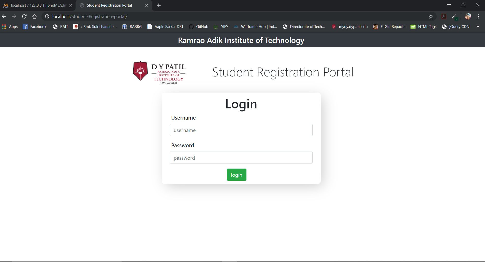

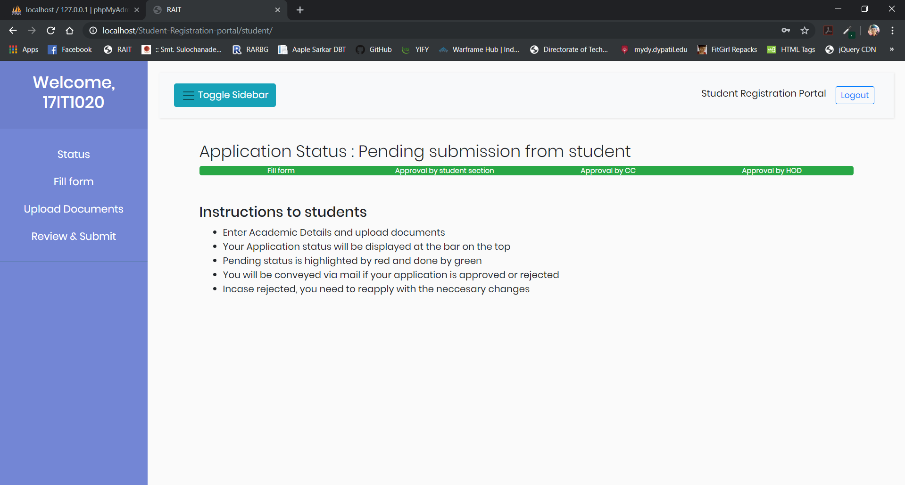

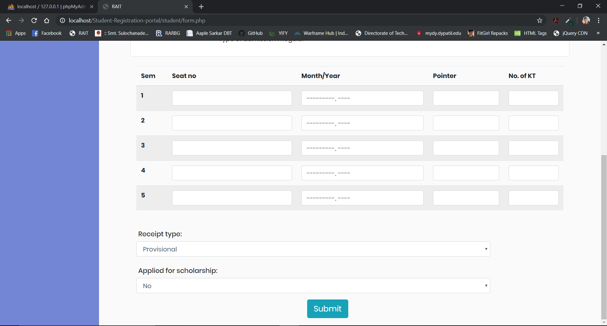

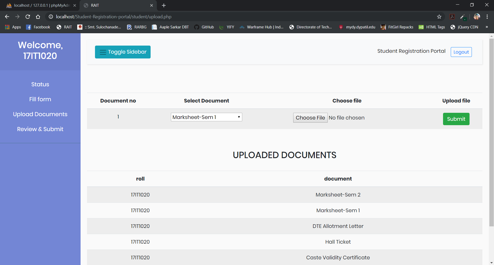

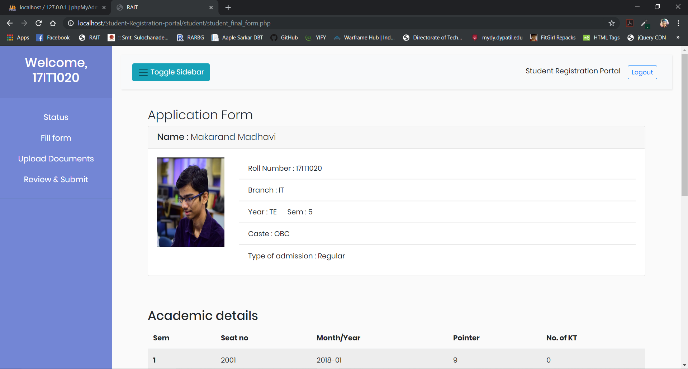

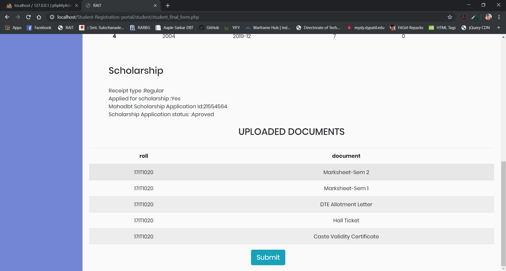

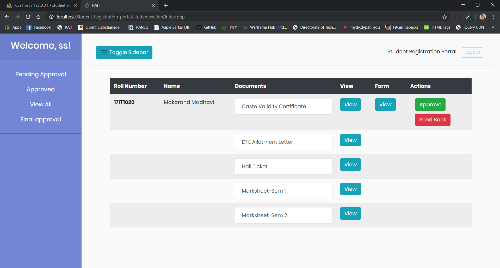

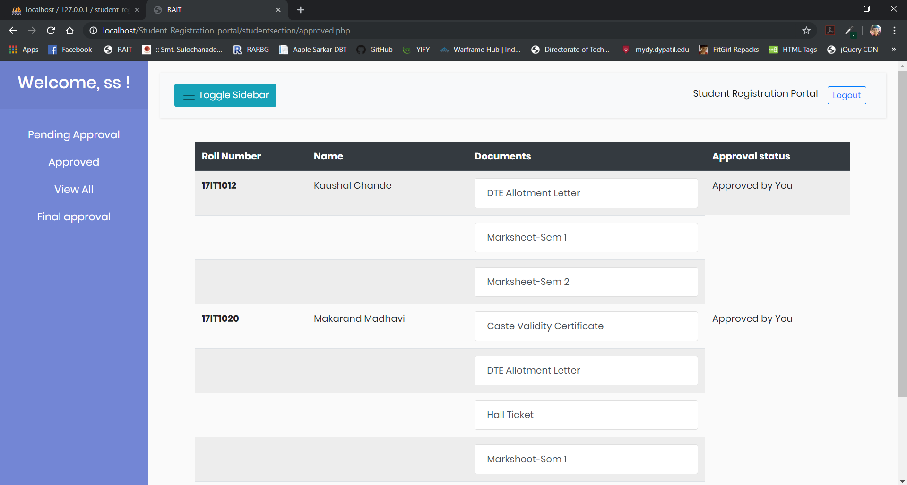

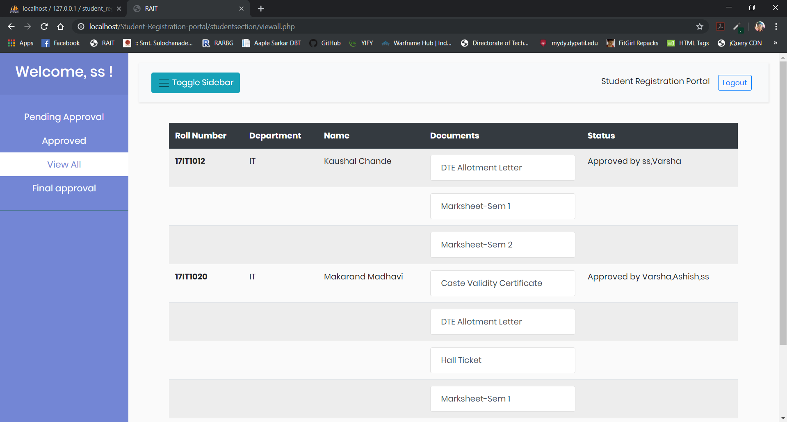

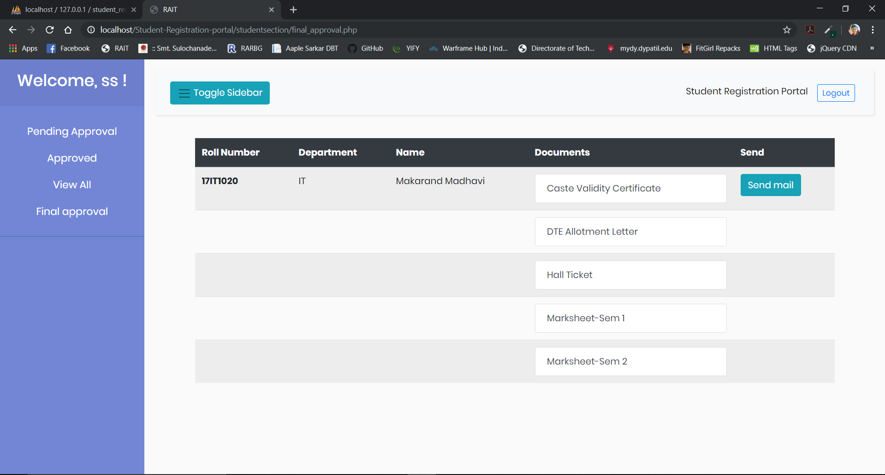

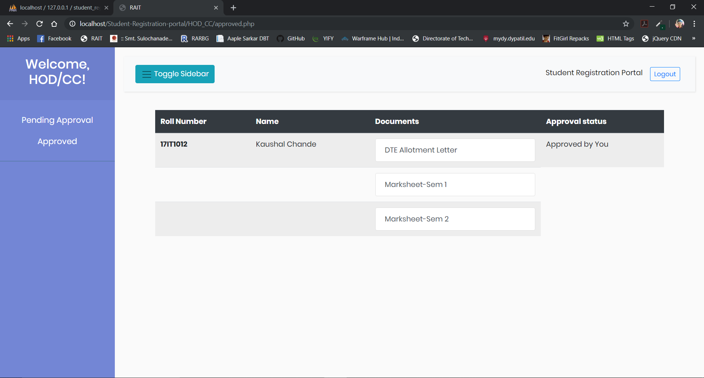

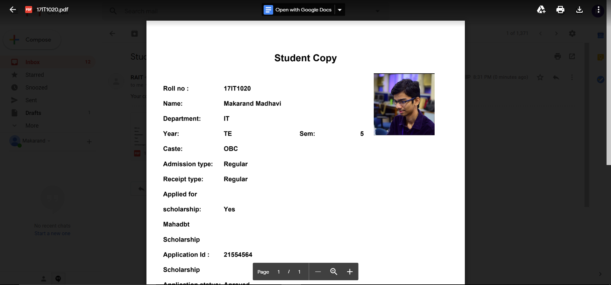